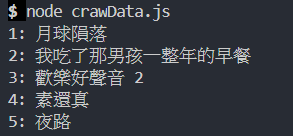

# cheerioDemo


POC for Nodejs web crawler.

TOP 5 movie in [Vieshow Cinema](https://www.vscinemas.com.tw/vsweb/film/hot.aspx).

## Usage

```
yarn
node crawData.js
```

## Result



## TODO

- [x] basic usage
- [x] save file (csv, xlsx)
- [ ] nightwatch manipulate
- [ ] GUI
